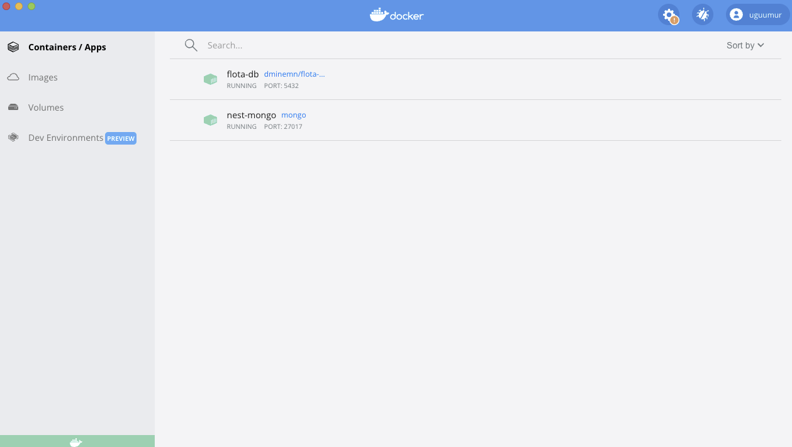

## yammi backend

required to install

- [NodeJS](https://nodejs.org/en/download/)
- [Docker](https://www.docker.com/products/docker-desktop)
- [DBeaver for Postgresql](https://dbeaver.io/)
- [Postman](https://www.postman.com/downloads/)

configuration

create `.env` file from `.env-sample`

## Database installation in a Docker

**postgresql**

```cmd
docker run --name nest-postgres -e POSTGRES_PASSWORD=123 -d -p 5432:5432 postgres
```



**installation**

```
npm i
```

Run

```
npm start
npm run dev
```
